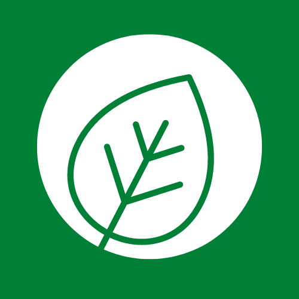

 

  

  <h1 align="center">MyRecipePal</h1>

  
Table of Contents

  <ol>
    <li>
      <a href="#about">📝 About</a>
    </li>
    <li><a href="#built">🛠️ Built With</a></li>
    <li><a href="#usage">⚙️ Usage</a></li>
    <li><a href="#chal">⛰️ Challenges</a></li>
    <li><a href="#roadmap">🛣️ Roadmap</a></li>
  </ol>

<h2 id = 'about'>📝About</h2>
As university students, we all understand that one of the biggest struggles of living by yourself is cooking food. We wanted to make it easy to find and craft new recipes, while still eating healthy.

<h2 id = 'built'>🛠️ Built With</h2>
We used React, JavaScript, ChakraUI, and Bootstrap for the frontend. For the backend. we used CockroachDB and Express.

<h2 id = 'usage'>⚙️ Usage</h2>
We didn't have time to host the backend, so the database won't work for regular users. If you host it locally, you are able to create recipes, search for recipes, and view recipes.

<h2 id = 'chal'>⛰️ Challenges</h2>
Before hacking started, one of our teammates felt sick and had to go home. Without him, a lot of our planning and ideas had to be delayed and reinvisioned. He was a big part of keeping our team together and energized throughout the night, so we were all discouraged from him leaving.

Instead of giving up, we took the loss of a teammate with even more determination to win. We utilized our resources, such as discord for communication, to help us continue moving forward with our project. As a result, we still managed to go beyond our expectations and make considerable progress on our project.

<h2 id = 'roadmap'>🛣️ Roadmap</h2>
In the future, we hope to add:

- Accounts/login system
- Forums for people to talk about recipes and health
- A tracker that keeps track of your meals, calorie intake, etc
